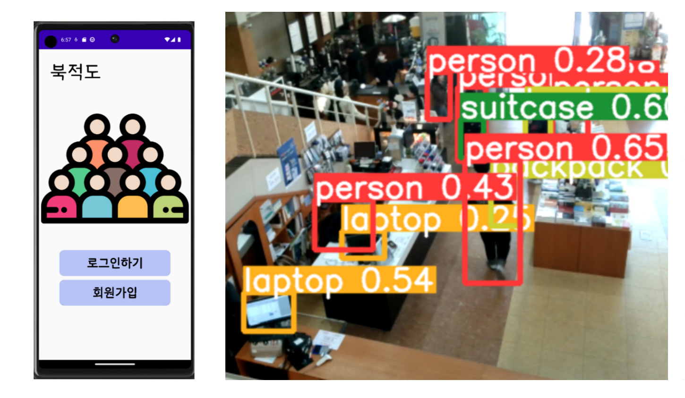

# Crowd Density Monitoring

A computer vision-based crowd density monitoring system developed as an undergraduate capstone project at the University of Ulsan (3-person team, 2023).

<p align="center">
  
</p>

## Overview

This project detects people in camera video and analyzes crowd density by zone to identify potentially crowded areas.
A webcam was installed at a CCTV-like viewpoint to reproduce real multi-use space conditions.
The detection results are delivered to users through an Android application.

## Pipeline

Camera input → Person detection (YOLOv5) → Zone-wise people counting → Risk level decision → Android app alert

## Features

- Person detection from real-time camera video
- Zone-based crowd density analysis and risk level decision
- Android application with user registration and login
- Map-based visualization of crowd information

## My Role

- Integrated the full flow from video input to detection, risk decision logic, and user alerts
- Identified missed detections of distant people during testing and tuned input resolution and detection settings

## Tech Stack

- **Computer Vision:** YOLOv5, OpenCV
- **Language:** Python, C++, Java
- **Mobile:** Android (Android Studio)
- **API:** Map API

## Project Structure

```text
crowd-density-monitoring/
├── android-app/        # Android application
├── assets/             # Demo images
├── README.md
└── .gitignore
```

## Results

The system detects people in crowded environments, estimates zone-wise density, and delivers risk alerts through the mobile application.

## Roadmap

- [ ] Real-time person detection with YOLOv5
- [ ] Zone-based crowd density analysis and risk level decision
- [ ] Android application with alerts and map visualization
- [ ] Release the person detection and density analysis module (Python)

## Award

🏆 First Prize (최우수상), Undergraduate Capstone Design Competition, School of IT Convergence, University of Ulsan, 2023

## Notes

This repository currently contains the Android application code from the capstone project.
The person detection and density analysis module will be released in this repository.
Some backend services used during the original development are no longer maintained.
